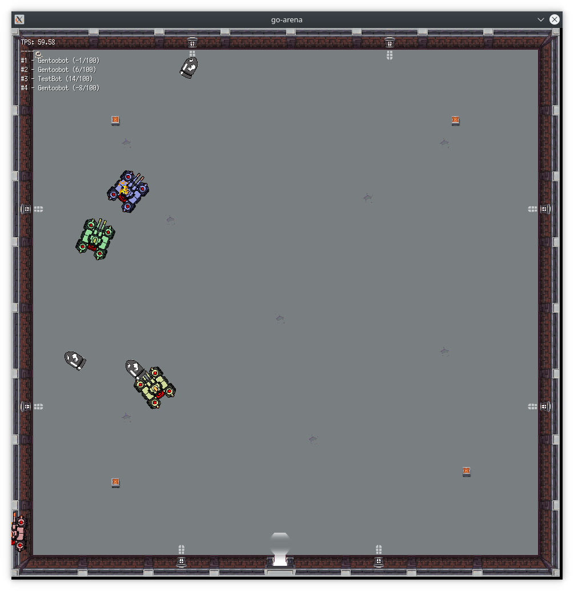

# go-arena

_***This is a wip project!***_

## What?
go-arena is a [Robocode](https://robocode.sourceforge.io/) clone written in go and [ebiten](https://ebiten.org/)

You create code that controls your tank.
Last tank to survive is the winner.

## Let them fight

### compile the robots

    # in the main directory
    make build

### start the battle

Specify the compiled bots with `-b` parameter:

    go run . -b bots/testbot/testbot.so -b bots/gentoobot/gentoobot.so

## write your own bot

Check out the code for [TestBot](bots/testbot/testbot.go).

To compile run:

    go build -buildmode=plugin -o newbot.so newbot.go

## State

- Bots can move and change orientation.
- Bots have view range within which they can "see" enemies.
- They can crash into the level boundary and notice it (and loose health:))
- They notice when they get hit by flying shells.

There's a lot left to do but updates are coming constantly.
